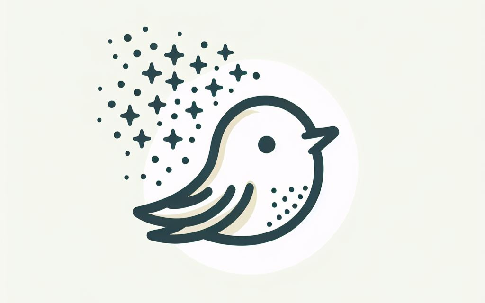

# Peerd

[![Build Status]][build-status]
[![Kind CI Status]][kind-ci-status]
[![Release CI]][release-ci]
[![CodeQL]][code-ql]
[![Go Report Card]][go-report-card]
[![codecov]][code-cov]
[![release-tag]][peerd-pkgs]

---

Peerd enhances [Azure Artifact Streaming] performance by enabling peer-to-peer distribution in a Kubernetes cluster.
Nodes can share streamable content with each other, which can result in throughput and latency improvements.

## Usage Guide

See the [usage guide][usage.md] to get started.

## Design and Architecture

Read the [design.md] document to understand the architecture and design of Peerd.

## Contributing

Please read our [contribution guide][CONTRIBUTING.md] which outlines all of our policies, procedures, and requirements
for contributing to this project.

## Code of Conduct

Please see [CODE_OF_CONDUCT.md] for further details.

## Acknowledgments

- Thanks to Philip Laine and Simon Gottschlag at Xenit for generously sharing their insights on [Spegel] with us.
- Thanks to [DADI P2P Proxy] for demonstrating the integration with [Overlaybd].

---

[Azure Artifact Streaming]: https://learn.microsoft.com/en-us/azure/container-registry/container-registry-artifact-streaming
[Build Status]: https://github.com/azure/peerd/actions/workflows/build.yml/badge.svg
[build-status]: https://github.com/azure/peerd/actions/workflows/build.yml
[codecov]: https://codecov.io/gh/Azure/peerd/branch/main/graph/badge.svg
[code-cov]: https://codecov.io/gh/Azure/peerd
[CODE_OF_CONDUCT.md]: CODE_OF_CONDUCT.md
[CodeQL]: https://github.com/Azure/peerd/actions/workflows/github-code-scanning/codeql/badge.svg?branch=main
[code-ql]: https://github.com/Azure/peerd/actions/workflows/github-code-scanning/codeql
[CONTRIBUTING.md]: CONTRIBUTING.md
[DADI P2P Proxy]: https://github.com/data-accelerator/dadi-p2proxy
[design.md]: ./docs/design.md
[Go Report Card]: https://goreportcard.com/badge/github.com/azure/peerd
[go-report-card]: https://goreportcard.com/report/github.com/azure/peerd
[Kind CI Status]: https://github.com/azure/peerd/actions/workflows/kind.yml/badge.svg
[kind-ci-status]: https://github.com/azure/peerd/actions/workflows/kind.yml
[Overlaybd]: https://github.com/containerd/overlaybd
[peerd-pkgs]: https://github.com/Azure/peerd/pkgs/container/acr%2Fdev%2Fpeerd
[Release CI]: https://github.com/azure/peerd/actions/workflows/release.yml/badge.svg
[release-ci]: https://github.com/azure/peerd/actions/workflows/release.yml
[release-tag]: https://img.shields.io/github/v/tag/Azure/peerd?label=Docker%20Image%20Tag
[Spegel]: https://github.com/XenitAB/spegel
[usage.md]: ./docs/usage.md